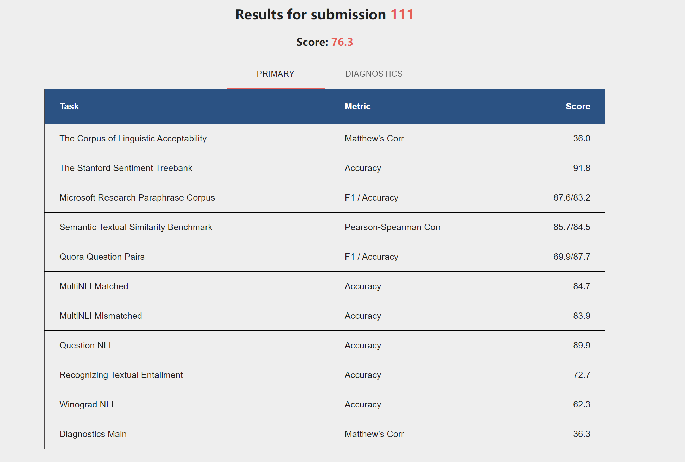

# PEKD
this repository is for prameter efficient online distillation
## instalition
run download.py to download the glue datasets. 
download "bert-base-uncased" checkpoint from huggingface  
download "tinybert" checkpoint from https://github.com/lxk00/BERT-EMD  
download metric from huggingface
## run pekd
run run_pekd.py
## glue test
run runtest.py
## the glue test score for our PEKD is:

