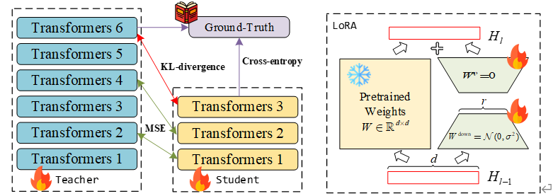

# PEKD: Parameter-Efficient Online Knowledge Distillation for Pretrained Language Model
this repository is for prameter efficient online distillation

## 🔥 installtion
```
run download.py to download the glue datasets.<br>
download "bert-base-uncased" checkpoint from huggingface <br>
download "tinybert" checkpoint from https://github.com/lxk00/BERT-EMD <br>
download metric from huggingface
```
## 🚀 run pekd
```
python run_pekd.py
```
## glue test
```
python runtest.py
```
## the glue test score for our PEKD is:


